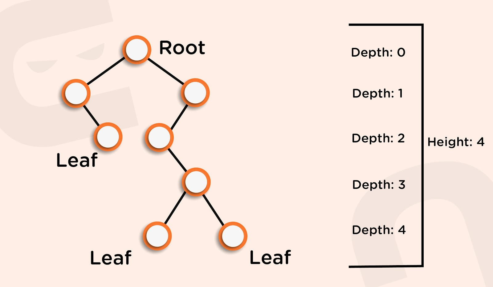

### Trees

* A tree is a data structure similar to linked lists but instead of each node pointing to just one next node in a linear fashion, each node points to a number of nodes. The tree is a non-linear data structure. A tree structure is a way of representing a hierarchical nature of a structure in a graphical form.

* Properties of Trees

    - Root: The root of the tree is the node with no parents. There can be at most one root node in the tree (Eg: A is the root node in the above example).
    - Parent: For a given node, its immediate predecessor is known as its parent node. In other words, nodes having 1 or more children are parent nodes. (Eg: A is the parent node of B, C, D, E, and C is the parent node of F, G)
    - Edge: An edge refers to the link from the parent node to the child node.
    - Leaf: Nodes with no children are called leaf nodes (Eg: B, F, G, D, E are leaf nodes in the above example).
    - Siblings: Children with the same parent are called siblings. (Eg: B, C, D, E are siblings, and F, G are siblings). A node x is an ancestor of node y if there exists a path from the root to node y such that x appears on the path. Node y is called the descendant of node x. (Eg: A is an ancestor of node F, G)
    - Depth: The depth of a node in the tree is the length of the path from the root to the node. The depth of the tree is the maximum depth among all the nodes in the tree.
    - Height: The height of the node is the length of the path from that node to the deepest node in the tree. The height of the tree is the length of the path from the root node to the deepest node in the tree. (Eg: the height of the tree in the above example is four (count the edges, not the nodes)).
    A tree with only one node has zero height.
    For a given tree, depth and height returns the same value but may be different for individual nodes.
    - Skew Trees: If every node in a tree has only one child then we call such a tree a skew tree. If every node has only a left child, we call them left skew trees. If every node has only the right child, we call them right skew trees.